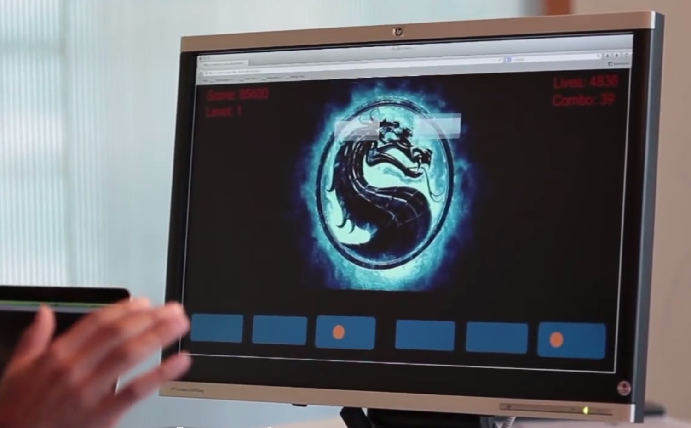

BlocktalKombat
==============

## Overview

BlocktalKombat is a [LEAP Motion](http://www.leapmotion.com/) catch-the-blocks game that runs in your browser. The game engine is built in Processing.js, and the browser gets data from the LEAP Motion controller using leap.js

Our project was so cool that it was featured in the [2013 Yelp Hackathon video](http://www.youtube.com/watch?v=EdY23VP0ets&t=40s)!

## Gameplay

Catch the falling blocks by moving your hands over the catching areas. Since user input is taken by the LEAP Motion controller, simply move your hands around in the air in front of the computer to interact with the game.

## Preview

<p align="center">
  <!--  -->
</p>

## Your Turn to Play

First, buy a LEAP Motion device and get the Visualizer working on your computer to verify that everything installed properly.

Then clone this repo by running the following command:
```
$ git clone git://github.com/nsax91/BlocktalKombat.git
```
and open index.html in Firefox or Safari (Chrome not supported yet).

Depending on your screen size, you'll want to either comment out the usage of game_pde.pde or game_pde_laptop.pde in index.html. This was a hackathon project, so don't judge us too hard for the crude design :)

## Contributors

1. [nsax91](http://www.github.com/nsax91)
2. [venkatesanp89](http://www.github.com/venkatesanp89)
3. [hari_was_here](https://www.github.com/hari_was_here)
